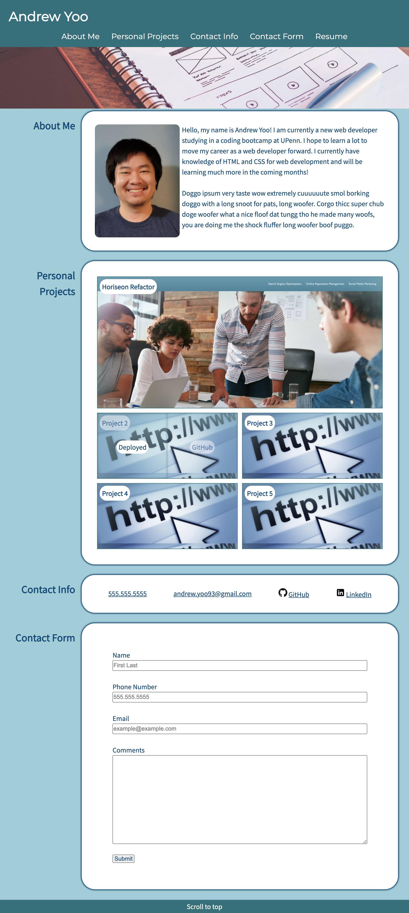

# andrew-yoo-portfolio
## Description
This website is about myself which includes a short biography, portfolio, contact and social media links, and a contact form.

## User Story

```
As an employer, I want to view a potential employee's deployed portfolio of work samples so that I can review samples of their work and assess whether they're a good candidate for an open position.
```

## Deployed web page visual
This website is to be used as my first portfolio website with the hover effect for the deployed link shown on Project 4.


## Features
The following are the features that were implemented:
* Navigation links to content on the page.
* Smooth scrolling for the navigation function.
* Footer and name in header navigates to top of the page.
* Responsive layout that adjusts to differing screen widths.
* Links to the deployed and GitHub pages for each project when the image is hovered over.
* Contact links that can be clicked to directly call for the phone number, directly email for the email link, or take you directly to the web pages for the GitHub and LinkedIn links.
* Contact form that will be an easy on page way to contact me. <!-- Does not yet have functionality as it has not yet been covered in class -->

## Deployed Link
https://andrewbyoo.github.io/andrew-yoo-portfolio/
